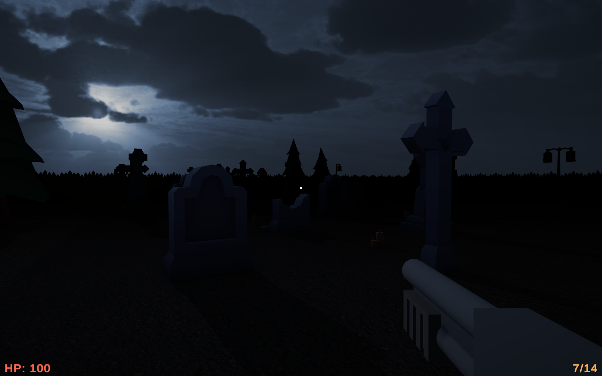
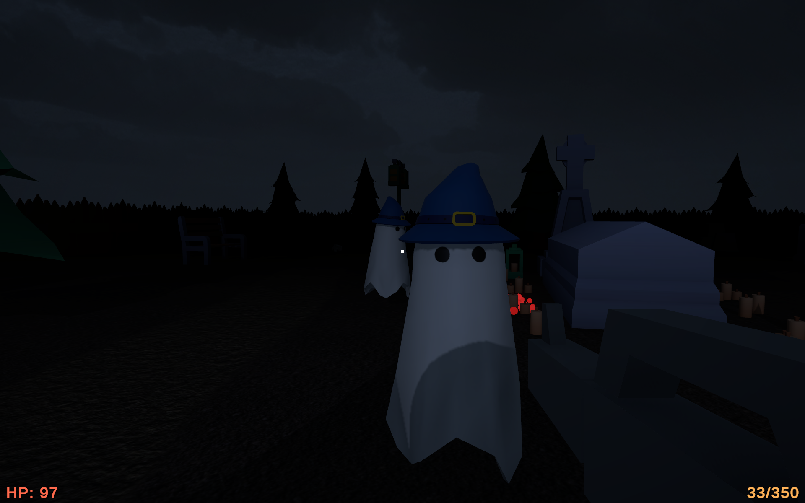
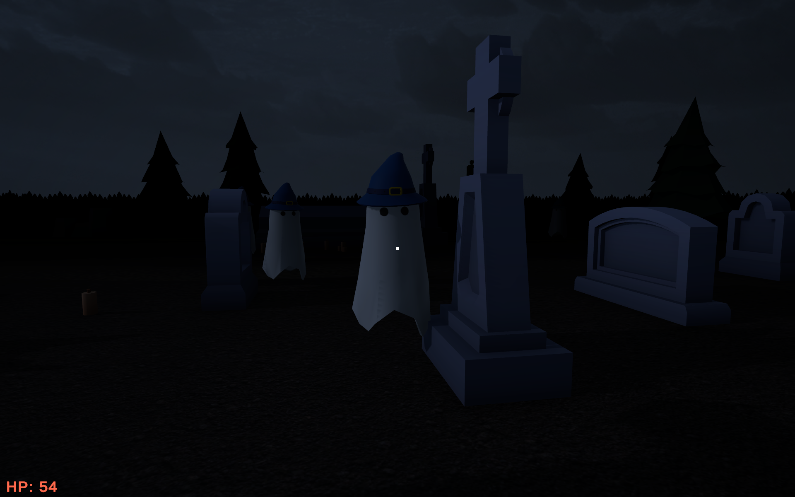
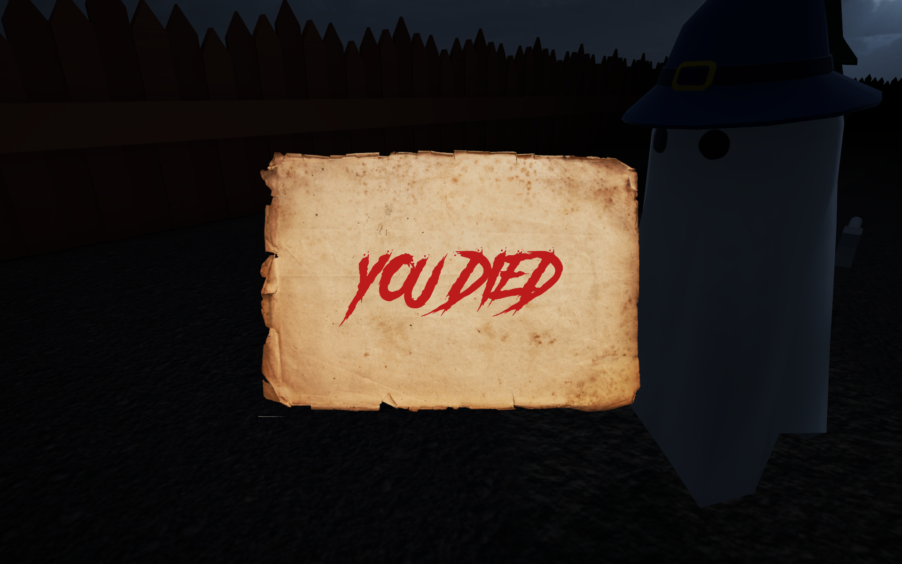

# GhostGrave

Welcome to GhostGrave!

## Description

GhostGrave is a *light* horror video game that takes place in a haunted graveyard.

## Installation

[Play Online](https://play.unity.com/mg/other/builds-op-15) (not recommended)

or

1. Clone the repository: `git clone https://github.com/ReloadingBee/GhostGrave.git`
2. Navigate to the project directory.
3. Open the game executable file.

## How to Play

- Use the WASD keys to move your character.
- Use the E key to pick up weapons.
- Use the LMB & RMB buttons to use weapons.
- Explore the environment, kill ghosts and survive!
  

## Contributing

We welcome contributions from the community! If you'd like to contribute to GhostGrave, please fork the repository and submit a pull request with your changes.

## Feedback

We value your feedback! If you have any suggestions, bug reports, or feature requests, please don't hesitate to open an issue on GitHub or email us at `reloadingbee@gmail.com`.

## License

GhostGrave is released under the [MIT License](LICENSE).

## Credits

- Developed by [ReloadingBee](https://github.com/ReloadingBee/).
- Sound effects obtained from the internet under licenses that allow us to use them.
- Visuals from [Unity Asset Store](https://assetstore.unity.com/).

